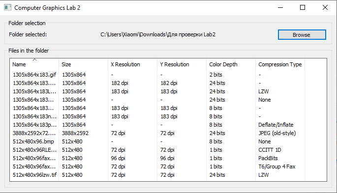
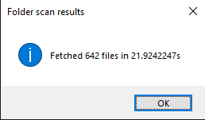

# Computer Graphics, lab 2

## Brief problem statement

Create a (web) app that fetches the main info about an image for all images in a folder (containing up to 100,000 
images). The following info is mandatory:
* File name
* Image size (in pixels)
* Resolution (in dpi)
* Color depth
* Compression type (when appropriate)

## Results

The program shows the fetching time every time you open a new folder via `MessageBox`.

The results of the speed test (642 `jpeg` files, ~2.75 GB):

## Requirements

* Go 1.15.3 or later (to build)
* Windows 7 or later

## Installation and usage

To get the source code, clone the repository or use

`go get github.com/alphaver/graphics-lab-2`

To run the app use a precompiled binary [`lab2.exe`](bin/lab2.exe) from the `bin` folder.

You may also build the project manually using `go build` from the `main` folder. The preferred form of the command is 

`go build -i -o bin/lab2.exe -ldflags="-H windowsgui" -tags walk_use_cgo` 

If you choose the manual build, then due to the use of the [`walk`](https://github.com/lxn/walk) package you should have
the `lab2.exe.manifest` file in the same directory where your binary is.

For the app to work, you must also have the `exiftool.exe` file nearby your binary.

## External tools used for the lab

* [`Exiftool`](https://exiftool.org/) — the Perl library (and a standalone tool) used to fetch the info about the images
* [`go-exiftool`](https://github.com/barasher/go-exiftool) — a Go wrapper package for `Exiftool`
* [`walk`](https://github.com/lxn/walk) — a Go package to create native Windows GUIs